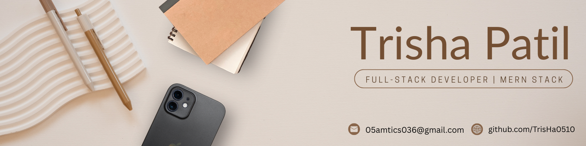

<h1 align="center">Hi 👋, I'm Trisha Patil</h1>
<h3 align="center">💻 Full-Stack Developer | MERN Stack | React · Node.js · MongoDB | B.Tech. IT 2027</h3>

  

---

## 👩‍💻 About Me

Full-Stack Developer skilled in the MERN Stack (MongoDB, Express.js, React.js, Node.js), 

currently pursuing B.Tech in Information Technology at Uka Tarsadia University (Batch 2027).

I enjoy building real-world web applications that solve practical problems — from managing 

academic workflows to seamless food ordering experiences.

Projects:

• Assignment Management System — role-based web app for students & teachers (MERN)

• Pizza Delivery App — full-stack food ordering platform with cart & order management (MERN)

Internship Experience:

• Zymo Research — Developed UI components, advertisement banners, and contributed 

  to mobile app development using Flutter & Dart

Tech Stack: React.js · Node.js · Express.js · MongoDB · JavaScript · HTML/CSS · Git · Flutter

📌 Batch 2027 | Targeting Full-Stack / MERN Developer Roles

      Open to placement opportunities & recruiter conversations.

---

## 🧠 Skills & Technologies

### 🖥️ Programming Languages

  
  
  
  
  

### 🎨 Frontend

  
  
  
  

### ⚙️ Backend

  
  
  
  

### 🗃️ Databases

  
  

### 🛠️ Tools & Platforms

  
  
  
  
  
  
  

---

## 🏆 Achievements & Certifications

- 🧾 **Python Programming** – Scaler Academy (2024)  
- 🧾 **Python Django 101** – Simplilearn SkillUp (June 2025)  
- 🧾 **Software Development Job Simulation** – Datacom (Forage)  
- 🧾 **Software Engineering Virtual Experience** – Accenture (Forage)  

---

## 🚀 Featured Projects

- 🍕 **Pizza Customization Web App** – Full-stack MERN app with admin panel, inventory management, and Razorpay integration.  
- 🎓 **GPA Calculator** – Interactive web app using HTML, CSS, and JavaScript.  
- 🧠 **DSA Project Collection** – Implementations of key data structures and algorithms in Python.  
- 📋 **Task Scheduler App** – Flask-based task management system with categories and recurring tasks.

---

## 📊 GitHub Stats

  
  

  

---

## 💬 Quote
> _“Code. Learn. Build. Repeat.”_  
> _“Turning ideas into impactful digital experiences.”_

---

## 🤝 Connect With Me

  
  
  
  

